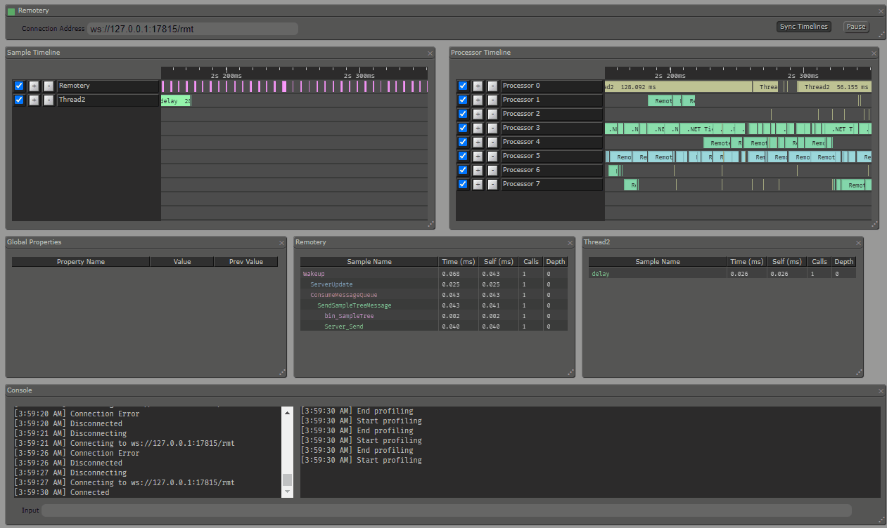

# Remotery-CSharp

C# bindings for https://github.com/Celtoys/Remotery with native dynamic link libraries based on [`imgui-cs`](https://github.com/bottlenoselabs/imgui-cs).

## How to use

### From source

1. Download and install [.NET 7](https://dotnet.microsoft.com/download).
2. Fork the repository using GitHub or clone the repository manually with submodules: `git clone --recurse-submodules https://github.com/clibequilibrium/Remotery-CSharp`.
3. Build the native library by running `library.sh`. To execute `.sh` scripts on Windows, use Git Bash which can be installed with Git itself: https://git-scm.com/download/win. The `library.sh` script requires that CMake is installed and in your path.
4. Locate the sample of the C# project: `./src/cs/production/Remotery/RemoterySample.csproj`.

## Developers: Documentation

For more information on how C# bindings work, see [`C2CS`](https://github.com/lithiumtoast/c2cs), the tool that generates the bindings for `Remotery` and other C libraries.

To learn how to use `Remotery`, check out the [official readme](https://github.com/Celtoys/Remotery).

## License

`Remotery-CSharp` is licensed under the MIT License (`MIT`) - see the [LICENSE file](LICENSE) for details.

`Remotery` itself is licensed under Apache License (`Apache`) - see https://github.com/Celtoys/Remotery/blob/main/LICENSE for more details.

